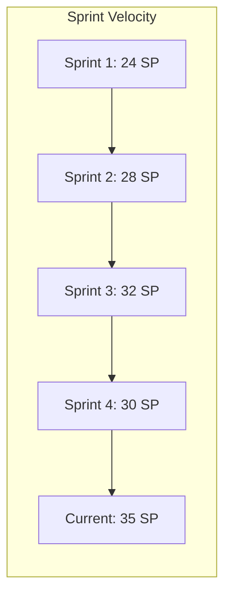
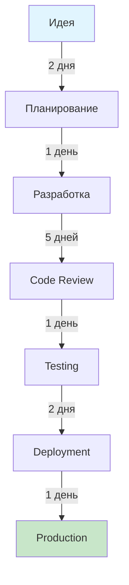
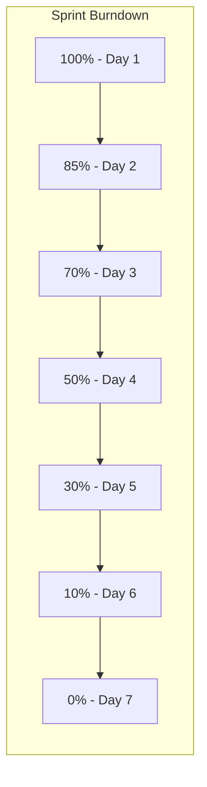
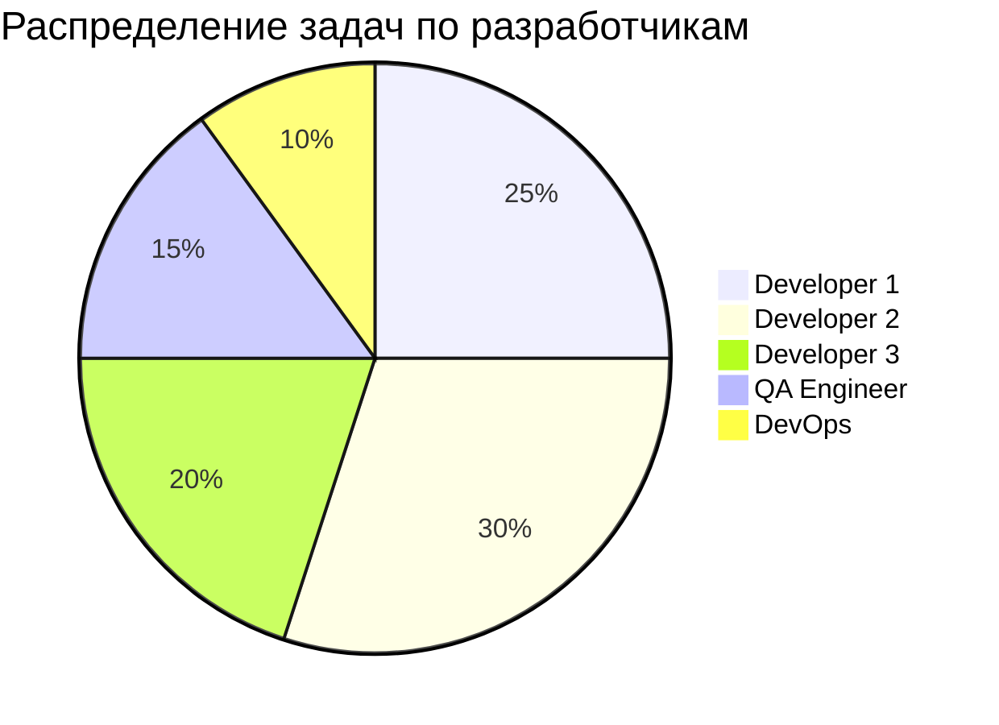
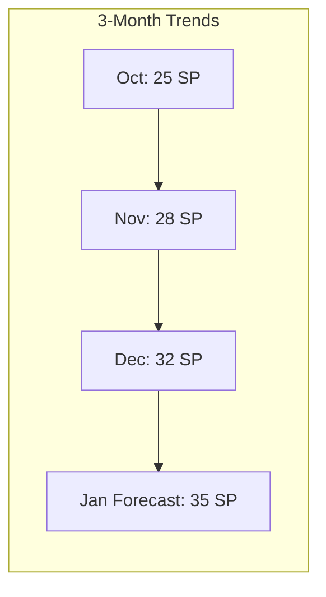
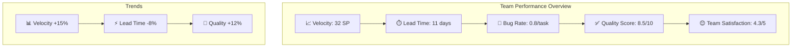
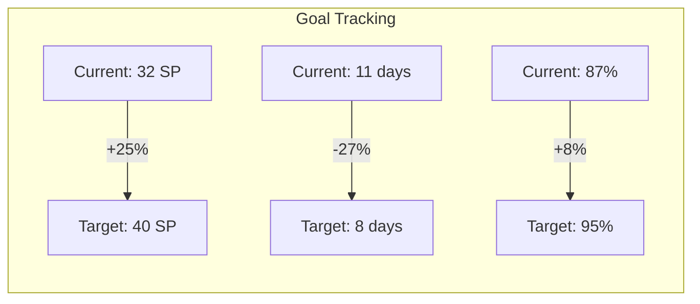

# 📊 Дашборд производительности команды

*Последнее обновление: Декабрь 2024*

## 🎯 Обзор дашборда

Дашборд производительности команды предоставляет комплексный обзор ключевых метрик разработки Albert3 Muse Synth Studio, помогая принимать обоснованные решения и оптимизировать рабочие процессы.

## 📈 Ключевые метрики

### 🚀 Производительность разработки

#### Velocity (Скорость команды)


**Текущие показатели:**
- **Средняя скорость**: 30 Story Points/спринт
- **Тренд**: ↗️ +15% за последний месяц
- **Цель**: 35 SP/спринт
- **Прогноз**: Достижение цели к концу месяца

#### Throughput (Пропускная способность)
- **Задачи в неделю**: 12-15 задач
- **Pull Requests в неделю**: 8-10 PR
- **Релизы в месяц**: 2-3 релиза
- **Hotfixes в месяц**: 0-1 hotfix

### ⏱️ Временные метрики

#### Lead Time (Время от идеи до продакшена)


**Средние показатели:**
- **Lead Time**: 12 дней (цель: 10 дней)
- **Cycle Time**: 8 дней (цель: 7 дней)
- **Review Time**: 1.5 дня (цель: 1 день)
- **Deploy Time**: 30 минут (цель: 15 минут)

#### Burndown Chart


### 📊 Качество кода

#### Code Quality Metrics
- **Code Coverage**: 85% (цель: 90%)
- **Technical Debt**: 2.5 дня (цель: <2 дня)
- **Duplication**: 3.2% (цель: <5%)
- **Maintainability Index**: 78/100 (цель: >80)

#### Bug Metrics
- **Bug Discovery Rate**: 2.1 bugs/1000 LOC
- **Bug Fix Rate**: 95% в течение спринта
- **Escaped Bugs**: 0.3 bugs/релиз
- **Critical Bugs**: 0 открытых

### 👥 Командные метрики

#### Распределение нагрузки


#### Участие в Code Review
- **Среднее время ответа**: 4 часа
- **Участие команды**: 95%
- **Качество ревью**: 4.2/5
- **Количество итераций**: 1.8 в среднем

## 📋 Еженедельный отчет

### Неделя: 2-8 Декабря 2024

#### 🎯 Достижения
- ✅ Завершено 14 задач (план: 12)
- ✅ Выпущен релиз v1.2.1
- ✅ Исправлены все критические баги
- ✅ Покрытие тестами увеличено до 87%

#### 📊 Ключевые метрики
| Метрика | Значение | Изменение | Статус |
|---------|----------|-----------|---------|
| Velocity | 32 SP | +2 SP | 🟢 |
| Lead Time | 11 дней | -1 день | 🟢 |
| Bug Count | 3 | -2 | 🟢 |
| Code Coverage | 87% | +2% | 🟢 |
| Team Satisfaction | 4.3/5 | +0.1 | 🟢 |

#### 🚫 Проблемы и блокеры
- **Задержка с API интеграцией**: Ожидание внешней команды
- **Нехватка времени на рефакторинг**: Планируется в следующем спринте
- **Проблемы с CI/CD**: Решены в середине недели

#### 📅 План на следующую неделю
- Завершить интеграцию с новым API
- Провести рефакторинг модуля аудио
- Подготовить релиз v1.3.0
- Обновить документацию

## 🎯 Индивидуальные метрики

### Developer Performance Dashboard

#### Developer 1 (Frontend Lead)
```markdown
**Период**: Декабрь 2024

📊 **Производительность**
- Завершенные задачи: 8/8 (100%)
- Story Points: 28 SP
- Code Reviews: 12 проведено, 6 получено
- Commits: 45 коммитов

⏱️ **Временные метрики**
- Среднее время задачи: 2.5 дня
- Время на ревью: 3 часа
- Время ответа на ревью: 2 часа

🎯 **Качество**
- Bug Rate: 0.8 bugs/задача
- Test Coverage: 92%
- Code Quality Score: 8.5/10

📈 **Тренды**
- Velocity: ↗️ +15%
- Quality: ↗️ +5%
- Satisfaction: 4.5/5
```

#### QA Engineer
```markdown
**Период**: Декабрь 2024

🧪 **Тестирование**
- Тест-кейсы выполнено: 156
- Баги найдено: 12
- Регрессионных тестов: 89
- Автоматизированных тестов: 34

📊 **Эффективность**
- Bug Detection Rate: 95%
- False Positive Rate: 5%
- Test Execution Time: -20%

🎯 **Качество**
- Critical Bugs Found: 2
- Test Coverage Increase: +5%
- Automation Coverage: 78%
```

## 📈 Тренды и прогнозы

### Долгосрочные тренды (3 месяца)

#### Производительность команды


#### Качество продукта
- **Bug Rate**: Снижение на 40%
- **Customer Satisfaction**: Рост с 3.8 до 4.3
- **Performance**: Улучшение на 25%
- **Security Score**: Рост с 85% до 92%

### Прогнозы на следующий квартал

#### Ожидаемые улучшения
- **Velocity**: +20% благодаря автоматизации
- **Lead Time**: -25% за счет оптимизации процессов
- **Quality**: +15% с внедрением новых инструментов
- **Team Satisfaction**: Поддержание на уровне 4.5+

## 🔧 Инструменты мониторинга

### Автоматизированный сбор метрик

#### GitHub Actions для сбора данных
```yaml
# .github/workflows/metrics-collection.yml
name: Team Metrics Collection

on:
  schedule:
    - cron: '0 9 * * 1'  # Каждый понедельник в 9:00

jobs:
  collect-metrics:
    runs-on: ubuntu-latest
    steps:
      - name: Collect GitHub metrics
        run: |
          # Сбор метрик из GitHub API
          python scripts/collect-github-metrics.py
      
      - name: Analyze code quality
        run: |
          # Анализ качества кода
          sonar-scanner
      
      - name: Generate dashboard
        run: |
          # Генерация дашборда
          python scripts/generate-dashboard.py
      
      - name: Update team dashboard
        run: |
          # Обновление дашборда в репозитории
          git add project-management/reports/team-dashboard.md
          git commit -m "chore: update team dashboard"
          git push
```

#### Скрипт сбора метрик
```python
# scripts/collect-github-metrics.py
import requests
import json
from datetime import datetime, timedelta

class TeamMetricsCollector:
    def __init__(self, token, repo):
        self.token = token
        self.repo = repo
        self.headers = {
            'Authorization': f'token {token}',
            'Accept': 'application/vnd.github.v3+json'
        }
    
    def collect_velocity_metrics(self):
        """Сбор метрик скорости команды"""
        # Получение закрытых issues за последнюю неделю
        week_ago = (datetime.now() - timedelta(days=7)).isoformat()
        
        url = f"https://api.github.com/repos/{self.repo}/issues"
        params = {
            'state': 'closed',
            'since': week_ago,
            'per_page': 100
        }
        
        response = requests.get(url, headers=self.headers, params=params)
        issues = response.json()
        
        # Подсчет Story Points
        total_sp = 0
        for issue in issues:
            labels = [label['name'] for label in issue['labels']]
            sp_labels = [l for l in labels if l.startswith('SP:')]
            if sp_labels:
                sp = int(sp_labels[0].split(':')[1])
                total_sp += sp
        
        return {
            'completed_issues': len(issues),
            'story_points': total_sp,
            'period': 'week'
        }
    
    def collect_lead_time_metrics(self):
        """Сбор метрик Lead Time"""
        # Анализ времени от создания до закрытия issues
        url = f"https://api.github.com/repos/{self.repo}/issues"
        params = {
            'state': 'closed',
            'per_page': 50
        }
        
        response = requests.get(url, headers=self.headers, params=params)
        issues = response.json()
        
        lead_times = []
        for issue in issues:
            created = datetime.fromisoformat(issue['created_at'].replace('Z', '+00:00'))
            closed = datetime.fromisoformat(issue['closed_at'].replace('Z', '+00:00'))
            lead_time = (closed - created).days
            lead_times.append(lead_time)
        
        return {
            'average_lead_time': sum(lead_times) / len(lead_times),
            'median_lead_time': sorted(lead_times)[len(lead_times)//2],
            'samples': len(lead_times)
        }
    
    def collect_pr_metrics(self):
        """Сбор метрик Pull Requests"""
        url = f"https://api.github.com/repos/{self.repo}/pulls"
        params = {
            'state': 'closed',
            'per_page': 50
        }
        
        response = requests.get(url, headers=self.headers, params=params)
        prs = response.json()
        
        review_times = []
        for pr in prs:
            if pr['merged_at']:
                created = datetime.fromisoformat(pr['created_at'].replace('Z', '+00:00'))
                merged = datetime.fromisoformat(pr['merged_at'].replace('Z', '+00:00'))
                review_time = (merged - created).total_seconds() / 3600  # в часах
                review_times.append(review_time)
        
        return {
            'merged_prs': len([pr for pr in prs if pr['merged_at']]),
            'average_review_time': sum(review_times) / len(review_times) if review_times else 0,
            'total_prs': len(prs)
        }
```

### Интеграция с внешними инструментами

#### SonarQube для качества кода
```yaml
# sonar-project.properties
sonar.projectKey=albert3-muse-synth-studio
sonar.organization=your-org
sonar.sources=src
sonar.tests=tests
sonar.javascript.lcov.reportPaths=coverage/lcov.info
sonar.coverage.exclusions=**/*.test.js,**/*.spec.js
```

#### Slack уведомления
```python
# scripts/slack-notifications.py
import requests
import json

def send_weekly_report(metrics):
    """Отправка еженедельного отчета в Slack"""
    
    message = {
        "text": "📊 Еженедельный отчет команды",
        "blocks": [
            {
                "type": "header",
                "text": {
                    "type": "plain_text",
                    "text": "📊 Team Performance Report"
                }
            },
            {
                "type": "section",
                "fields": [
                    {
                        "type": "mrkdwn",
                        "text": f"*Velocity:* {metrics['velocity']} SP"
                    },
                    {
                        "type": "mrkdwn",
                        "text": f"*Lead Time:* {metrics['lead_time']} дней"
                    },
                    {
                        "type": "mrkdwn",
                        "text": f"*Completed Tasks:* {metrics['completed_tasks']}"
                    },
                    {
                        "type": "mrkdwn",
                        "text": f"*Code Coverage:* {metrics['coverage']}%"
                    }
                ]
            }
        ]
    }
    
    webhook_url = "YOUR_SLACK_WEBHOOK_URL"
    requests.post(webhook_url, json=message)
```

## 📊 Визуализация данных

### Grafana Dashboard
```json
{
  "dashboard": {
    "title": "Albert3 Team Performance",
    "panels": [
      {
        "title": "Sprint Velocity",
        "type": "graph",
        "targets": [
          {
            "expr": "team_velocity",
            "legendFormat": "Story Points"
          }
        ]
      },
      {
        "title": "Lead Time Distribution",
        "type": "histogram",
        "targets": [
          {
            "expr": "lead_time_histogram",
            "legendFormat": "Days"
          }
        ]
      },
      {
        "title": "Code Quality Trends",
        "type": "stat",
        "targets": [
          {
            "expr": "code_coverage",
            "legendFormat": "Coverage %"
          }
        ]
      }
    ]
  }
}
```

### Mermaid диаграммы для отчетов


## 🎯 Цели и KPI

### Квартальные цели (Q1 2025)

#### Производительность
- **Velocity**: Увеличить до 40 SP/спринт
- **Lead Time**: Сократить до 8 дней
- **Deployment Frequency**: 2 релиза в неделю
- **MTTR**: Менее 2 часов

#### Качество
- **Code Coverage**: 95%
- **Bug Escape Rate**: Менее 0.1 bugs/релиз
- **Customer Satisfaction**: 4.5+/5
- **Security Score**: 95%+

#### Команда
- **Team Satisfaction**: 4.5+/5
- **Knowledge Sharing**: 2 презентации/месяц
- **Skill Development**: 1 новая технология/квартал
- **Retention Rate**: 100%

### Мониторинг достижения целей


## 📋 Действия по улучшению

### Краткосрочные действия (1-2 недели)
- [ ] Автоматизировать сбор метрик через GitHub Actions
- [ ] Настроить Slack уведомления для критических метрик
- [ ] Провести ретроспективу по текущим блокерам
- [ ] Обновить определение готовности (Definition of Done)

### Среднесрочные действия (1-2 месяца)
- [ ] Внедрить SonarQube для анализа качества кода
- [ ] Настроить Grafana дашборд для визуализации
- [ ] Провести обучение команды по новым инструментам
- [ ] Оптимизировать CI/CD pipeline

### Долгосрочные действия (3-6 месяцев)
- [ ] Внедрить предиктивную аналитику
- [ ] Автоматизировать планирование спринтов
- [ ] Создать систему раннего предупреждения о рисках
- [ ] Интегрировать с системами мониторинга продакшена

---

*Дашборд производительности команды обеспечивает прозрачность, подотчетность и непрерывное улучшение процессов разработки*