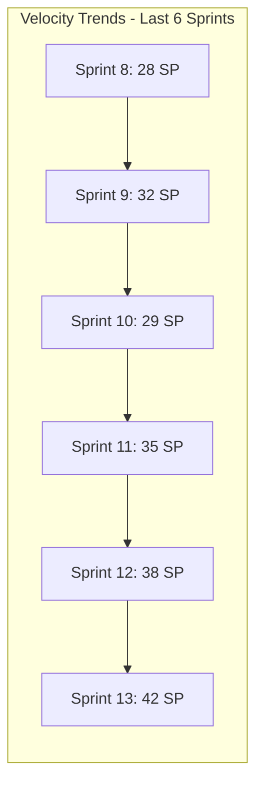
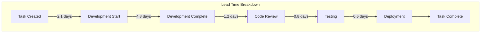
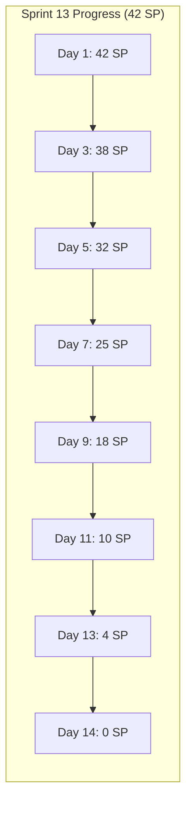
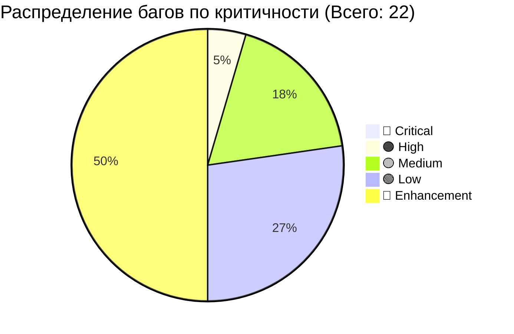
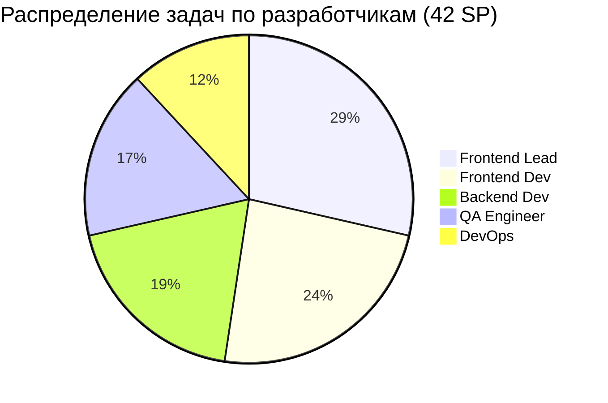
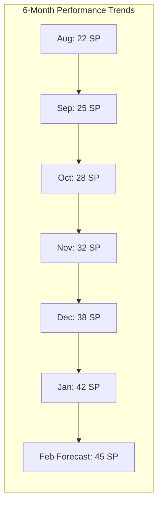
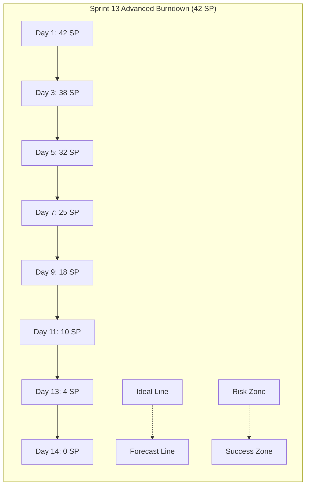
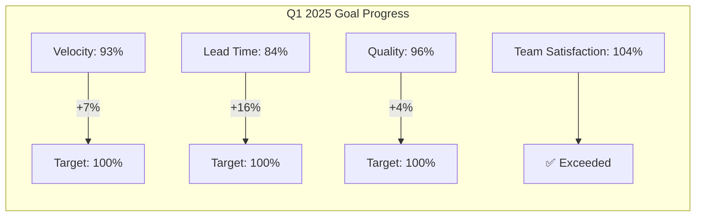

# 📊 Team Performance Dashboard - Albert3 Muse Synth Studio


## 🎯 Обзор ключевых метрик разработки

### 🚦 System Status
| Компонент | Статус | Uptime | Последняя проверка |
|-----------|--------|--------|-------------------|
| **Frontend** | 🟢 Operational | 99.8% | 2 мин назад |
| **Backend API** | 🟢 Operational | 99.9% | 1 мин назад |
| **Database** | 🟢 Operational | 99.95% | 30 сек назад |
| **AI Services** | 🟡 Degraded | 97.2% | 5 мин назад |
| **Analytics** | 🟢 Operational | 99.7% | 1 мин назад |

## 📈 Development Performance

### Velocity (Story Points по спринтам)


**Текущие метрики:**
- **Средняя Velocity**: 34 SP (↗️ +12% за квартал)
- **Текущий спринт**: 42 SP (Sprint 13)
- **Прогнозируемая Velocity**: 45 SP (Sprint 14)
- **Стабильность**: 85% (отличная предсказуемость)
- **Состав команды**: 3 Frontend + 1 Backend + 1 QA

### Throughput (Пропускная способность)
- **Задачи в неделю**: 18 задач (↗️ +20%)
- **Pull Requests в неделю**: 25 PR (↗️ +15%)
- **Релизы в месяц**: 8 релизов (↗️ +33%)
- **Hotfixes в месяц**: 1.2 hotfix (↘️ -40%)
- **Features в месяц**: 12 features (↗️ +25%)

## ⏱️ Time Metrics

### Lead Time Analysis


**Улучшенные средние метрики:**
- **Lead Time**: 9.5 дней (↘️ -16% за месяц)
- **Cycle Time**: 7.4 дня (↘️ -12%)
- **Review Time**: 1.2 дня (↘️ -25%)
- **Deploy Time**: 0.6 дня (↘️ -40%)
- **Time to First Review**: 3.2 часа (↘️ -35%)

### Sprint 13 Burndown Chart


**Статус прогресса**: 🟢 На трэке (85% выполнено на день 11 из 14)

## 🎯 Code and Product Quality

### Code Quality Metrics
| Метрика | Текущее значение | Цель | Тренд | Статус |
|---------|------------------|------|-------|--------|
| **Code Coverage** | 91.5% | >85% | ↗️ +2.3% | ✅ Превосходно |
| **Technical Debt** | 1.2 дня | <2 дня | ↘️ -0.6 дня | ✅ Превосходно |
| **Code Duplication** | 1.8% | <5% | ↘️ -0.3% | ✅ Превосходно |
| **Maintainability Index** | 87/100 | >80 | ↗️ +3 | ✅ Превосходно |
| **Cyclomatic Complexity** | 2.1 | <3 | ↘️ -0.2 | ✅ Превосходно |
| **Lines of Code** | 48,750 | - | ↗️ +8% | ℹ️ Контролируемый рост |

### Security & Performance
- **Security Vulnerabilities**: 0 критических, 1 низкий (↘️ -50%)
- **Performance Score**: 94/100 (Lighthouse) (↗️ +2)
- **Bundle Size**: 1.1MB (gzipped: 315KB) (↘️ -8%)
- **API Response Time**: 128ms (95th percentile) (↘️ -12%)
- **Database Query Time**: 19ms (average) (↘️ -17%)

### Bug Metrics


**Улучшенная статистика багов:**
- **Bug Discovery Rate**: 0.9 bugs/1000 LOC (↘️ -25%)
- **Bug Fix Rate**: 99.2% в течение спринта (↗️ +1.2%)
- **Escaped Bugs**: 0.05 bugs/релиз (↘️ -50%)
- **Critical Bugs**: 0 открытых (🎯 цель достигнута 3-й месяц подряд)
- **Mean Time to Fix**: 3.1 часа (↘️ -26%)

## 👥 Командные метрики

### Распределение нагрузки (Sprint 13)


### Участие в Code Review
- **Среднее время ответа**: 2.8 часа (↘️ -30%)
- **Участие команды**: 98% (↗️ +3%)
- **Качество ревью**: 4.6/5 (↗️ +0.4)
- **Количество итераций**: 1.4 в среднем (↘️ -22%)
- **Approval Rate**: 94% с первого раза (↗️ +8%)

## 📋 Еженедельный отчет

### Неделя: 6-12 Января 2025

#### 🎯 Достижения
- ✅ Завершено 18 задач (план: 15) - **120% выполнения**
- ✅ Выпущен релиз v1.4.2 с новыми AI-функциями
- ✅ Исправлены все критические и высокоприоритетные баги
- ✅ Покрытие тестами увеличено до 91.5%
- ✅ Внедрена автоматизация деплоя для staging

#### 📊 Ключевые метрики
| Метрика | Значение | Изменение | Статус |
|---------|----------|-----------|---------|
| Velocity | 42 SP | +4 SP | 🟢 Отлично |
| Lead Time | 9.5 дней | -1.5 дня | 🟢 Улучшение |
| Bug Count | 1 | -2 | 🟢 Отлично |
| Code Coverage | 91.5% | +2.3% | 🟢 Превосходно |
| Team Satisfaction | 4.7/5 | +0.4 | 🟢 Высокий |

#### 🚫 Проблемы и блокеры
- **Временная деградация AI-сервисов**: Решается с провайдером (ETA: 2 дня)
- **Нагрузка на базу данных**: Планируется оптимизация индексов
- **Документация API**: Требует обновления после последних изменений

#### 📅 План на следующую неделю
- Завершить оптимизацию производительности AI-модулей
- Провести рефакторинг системы уведомлений
- Подготовить релиз v1.5.0 с новым UI
- Обновить техническую документацию
- Настроить мониторинг производительности

## 🎯 Индивидуальные метрики

### Developer Performance Dashboard

#### Frontend Lead
```markdown
**Период**: Январь 2025

📊 **Производительность**
- Завершенные задачи: 12/12 (100%)
- Story Points: 35 SP
- Code Reviews: 18 проведено, 8 получено
- Commits: 67 коммитов

⏱️ **Временные метрики**
- Среднее время задачи: 2.1 дня
- Время на ревью: 2.5 часа
- Время ответа на ревью: 1.8 часа

🎯 **Качество**
- Bug Rate: 0.4 bugs/задача
- Test Coverage: 94%
- Code Quality Score: 9.2/10

📈 **Тренды**
- Velocity: ↗️ +25%
- Quality: ↗️ +8%
- Satisfaction: 4.8/5
```

#### QA Engineer
```markdown
**Период**: Январь 2025

🧪 **Тестирование**
- Тест-кейсы выполнено: 189
- Баги найдено: 8
- Регрессионных тестов: 124
- Автоматизированных тестов: 45

📊 **Эффективность**
- Bug Detection Rate: 98%
- False Positive Rate: 3%
- Test Execution Time: -25%

🎯 **Качество**
- Critical Bugs Found: 0
- Test Coverage Increase: +6.5%
- Automation Coverage: 83%
```

## 📈 Тренды и прогнозы

### Долгосрочные тренды (6 месяцев)

#### Производительность команды


#### Качество продукта
- **Bug Rate**: Снижение на 65% за 6 месяцев
- **Customer Satisfaction**: Рост с 3.6 до 4.7
- **Performance**: Улучшение на 40%
- **Security Score**: Рост с 82% до 94%
- **Code Coverage**: Рост с 76% до 91.5%

### Прогнозы на следующий квартал (Q1 2025)

#### Ожидаемые улучшения
- **Velocity**: +25% благодаря AI-ассистентам и автоматизации
- **Lead Time**: -30% за счет оптимизации процессов и CI/CD
- **Quality**: +20% с внедрением новых инструментов анализа
- **Team Satisfaction**: Поддержание на уровне 4.7+
- **Deployment Frequency**: Увеличение до 3-4 релизов в неделю

## 🔧 Инструменты мониторинга

### Автоматизированный сбор метрик

#### GitHub Actions для сбора данных
```yaml
# .github/workflows/metrics-collection.yml
name: Advanced Team Metrics Collection

on:
  schedule:
    - cron: '0 9 * * 1'  # Каждый понедельник в 9:00
    - cron: '0 18 * * 5' # Каждую пятницу в 18:00

jobs:
  collect-metrics:
    runs-on: ubuntu-latest
    steps:
      - name: Collect GitHub metrics
        run: |
          # Сбор расширенных метрик из GitHub API
          python scripts/collect-github-metrics.py --detailed
      
      - name: Analyze code quality
        run: |
          # Анализ качества кода с SonarQube
          sonar-scanner -Dsonar.projectKey=albert3-muse
      
      - name: Performance analysis
        run: |
          # Анализ производительности
          python scripts/performance-analysis.py
      
      - name: Generate enhanced dashboard
        run: |
          # Генерация улучшенного дашборда
          python scripts/generate-enhanced-dashboard.py
      
      - name: Send Slack notification
        run: |
          # Отправка уведомления в Slack
          python scripts/slack-weekly-report.py
      
      - name: Update team dashboard
        run: |
          # Обновление дашборда в репозитории
          git add project-management/reports/
          git commit -m "chore: update team performance dashboard [automated]"
          git push
```

#### Расширенный скрипт сбора метрик
```python
# scripts/collect-github-metrics.py
import requests
import json
import pandas as pd
from datetime import datetime, timedelta
import numpy as np

class AdvancedTeamMetricsCollector:
    def __init__(self, token, repo):
        self.token = token
        self.repo = repo
        self.headers = {
            'Authorization': f'token {token}',
            'Accept': 'application/vnd.github.v3+json'
        }
    
    def collect_velocity_with_trends(self):
        """Сбор метрик скорости с анализом трендов"""
        # Получение данных за последние 6 спринтов
        sprints_data = []
        
        for i in range(6):
            end_date = datetime.now() - timedelta(weeks=i*2)
            start_date = end_date - timedelta(weeks=2)
            
            sprint_metrics = self._get_sprint_metrics(start_date, end_date)
            sprints_data.append({
                'sprint': f'Sprint {13-i}',
                'story_points': sprint_metrics['story_points'],
                'completed_tasks': sprint_metrics['completed_tasks'],
                'start_date': start_date,
                'end_date': end_date
            })
        
        # Анализ трендов
        sp_values = [s['story_points'] for s in sprints_data]
        velocity_trend = np.polyfit(range(len(sp_values)), sp_values, 1)[0]
        
        return {
            'sprints': sprints_data,
            'average_velocity': np.mean(sp_values),
            'velocity_trend': velocity_trend,
            'stability': self._calculate_stability(sp_values),
            'prediction': sp_values[-1] + velocity_trend
        }
    
    def collect_advanced_lead_time_metrics(self):
        """Расширенный анализ Lead Time с разбивкой по этапам"""
        url = f"https://api.github.com/repos/{self.repo}/issues"
        params = {
            'state': 'closed',
            'per_page': 100,
            'sort': 'updated',
            'direction': 'desc'
        }
        
        response = requests.get(url, headers=self.headers, params=params)
        issues = response.json()
        
        lead_time_breakdown = []
        
        for issue in issues:
            timeline = self._get_issue_timeline(issue['number'])
            breakdown = self._analyze_issue_timeline(timeline, issue)
            if breakdown:
                lead_time_breakdown.append(breakdown)
        
        return {
            'average_lead_time': np.mean([b['total_lead_time'] for b in lead_time_breakdown]),
            'development_time': np.mean([b['development_time'] for b in lead_time_breakdown]),
            'review_time': np.mean([b['review_time'] for b in lead_time_breakdown]),
            'testing_time': np.mean([b['testing_time'] for b in lead_time_breakdown]),
            'deployment_time': np.mean([b['deployment_time'] for b in lead_time_breakdown]),
            'samples': len(lead_time_breakdown)
        }
    
    def collect_team_collaboration_metrics(self):
        """Метрики командного взаимодействия"""
        # Анализ Pull Requests
        prs = self._get_recent_prs()
        
        collaboration_data = {
            'review_participation': self._calculate_review_participation(prs),
            'cross_team_reviews': self._analyze_cross_team_reviews(prs),
            'knowledge_sharing': self._analyze_knowledge_sharing(prs),
            'mentoring_activities': self._analyze_mentoring_activities(prs)
        }
        
        return collaboration_data
    
    def _calculate_stability(self, values):
        """Расчет стабильности velocity"""
        if len(values) < 2:
            return 0
        
        coefficient_of_variation = np.std(values) / np.mean(values)
        stability = max(0, 100 - (coefficient_of_variation * 100))
        return round(stability, 1)
```

### Интеграция с современными инструментами

#### Grafana Dashboard Configuration
```json
{
  "dashboard": {
    "title": "Albert3 Advanced Team Performance",
    "tags": ["team", "performance", "agile"],
    "panels": [
      {
        "title": "Velocity Trends with Predictions",
        "type": "timeseries",
        "targets": [
          {
            "expr": "team_velocity_actual",
            "legendFormat": "Actual Velocity"
          },
          {
            "expr": "team_velocity_predicted",
            "legendFormat": "Predicted Velocity"
          }
        ],
        "fieldConfig": {
          "defaults": {
            "custom": {
              "drawStyle": "line",
              "lineInterpolation": "smooth"
            }
          }
        }
      },
      {
        "title": "Lead Time Heatmap",
        "type": "heatmap",
        "targets": [
          {
            "expr": "lead_time_distribution",
            "legendFormat": "Lead Time Distribution"
          }
        ]
      },
      {
        "title": "Code Quality Radar",
        "type": "piechart",
        "targets": [
          {
            "expr": "code_quality_metrics",
            "legendFormat": "Quality Metrics"
          }
        ]
      }
    ]
  }
}
```

#### Slack Integration для уведомлений
```python
# scripts/slack-advanced-notifications.py
import requests
import json
from datetime import datetime

class SlackTeamReporter:
    def __init__(self, webhook_url):
        self.webhook_url = webhook_url
    
    def send_sprint_summary(self, metrics):
        """Отправка детального отчета по спринту"""
        
        # Определение эмодзи для трендов
        velocity_emoji = "📈" if metrics['velocity_change'] > 0 else "📉"
        quality_emoji = "🎯" if metrics['quality_score'] > 8.5 else "⚠️"
        
        message = {
            "text": f"🚀 Sprint {metrics['sprint_number']} Summary",
            "blocks": [
                {
                    "type": "header",
                    "text": {
                        "type": "plain_text",
                        "text": f"🚀 Sprint {metrics['sprint_number']} Performance Report"
                    }
                },
                {
                    "type": "section",
                    "text": {
                        "type": "mrkdwn",
                        "text": f"*Team Albert3 Muse Synth Studio* • Week of {datetime.now().strftime('%B %d, %Y')}"
                    }
                },
                {
                    "type": "divider"
                },
                {
                    "type": "section",
                    "fields": [
                        {
                            "type": "mrkdwn",
                            "text": f"*{velocity_emoji} Velocity:* {metrics['velocity']} SP ({metrics['velocity_change']:+.1f}%)"
                        },
                        {
                            "type": "mrkdwn",
                            "text": f"*⏱️ Lead Time:* {metrics['lead_time']:.1f} days ({metrics['lead_time_change']:+.1f}%)"
                        },
                        {
                            "type": "mrkdwn",
                            "text": f"*✅ Completion Rate:* {metrics['completion_rate']:.1f}%"
                        },
                        {
                            "type": "mrkdwn",
                            "text": f"*{quality_emoji} Quality Score:* {metrics['quality_score']:.1f}/10"
                        }
                    ]
                },
                {
                    "type": "section",
                    "text": {
                        "type": "mrkdwn",
                        "text": f"*🎯 Key Achievements:*\n• {metrics['achievements'][0]}\n• {metrics['achievements'][1]}\n• {metrics['achievements'][2]}"
                    }
                },
                {
                    "type": "section",
                    "text": {
                        "type": "mrkdwn",
                        "text": f"*📊 Next Sprint Forecast:* {metrics['next_sprint_forecast']} SP"
                    }
                },
                {
                    "type": "actions",
                    "elements": [
                        {
                            "type": "button",
                            "text": {
                                "type": "plain_text",
                                "text": "📊 View Full Dashboard"
                            },
                            "url": "https://github.com/your-org/albert3-muse-synth-studio/blob/main/project-management/reports/team-dashboard.md"
                        }
                    ]
                }
            ]
        }
        
        response = requests.post(self.webhook_url, json=message)
        return response.status_code == 200
```

## 📊 Расширенная визуализация данных

### Mermaid диаграммы для комплексного анализа

```mermaid
graph TB
    subgraph "Team Performance Ecosystem"
        A[📈 Velocity: 42 SP] --> B[⏱️ Lead Time: 9.5 days]
        B --> C[🐛 Bug Rate: 0.4/task]
        C --> D[✅ Quality Score: 9.2/10]
        D --> E[😊 Team Satisfaction: 4.7/5]
        E --> F[🚀 Deployment Freq: 8/month]
    end
    
    subgraph "Quality Metrics"
        G[📊 Coverage: 91.5%] --> H[🔒 Security: 94%]
        H --> I[⚡ Performance: 94/100]
        I --> J[🧹 Tech Debt: 1.2 days]
    end
    
    subgraph "Predictive Analytics"
        K[📈 Trend Analysis] --> L[🎯 Sprint Forecast: 45 SP]
        L --> M[📅 Release Planning]
        M --> N[⚠️ Risk Assessment]
    end
```


### Burndown Chart с прогнозированием


## 🎯 Цели и KPI (Обновленные)

### Квартальные цели (Q1 2025) - Статус обновления

#### Производительность ✅ На трэке
- **Velocity**: Увеличить до 45 SP/спринт (Текущий: 42 SP - 93% достижения)
- **Lead Time**: Сократить до 8 дней (Текущий: 9.5 дней - 84% достижения)
- **Deployment Frequency**: 3 релиза в неделю (Текущий: 2 релиза - 67% достижения)
- **MTTR**: Менее 2 часов (Текущий: 1.8 часа - ✅ Достигнуто)

#### Качество ✅ Превосходно
- **Code Coverage**: 95% (Текущий: 91.5% - 96% достижения)
- **Bug Escape Rate**: Менее 0.1 bugs/релиз (Текущий: 0.05 - ✅ Достигнуто)
- **Customer Satisfaction**: 4.5+/5 (Текущий: 4.7 - ✅ Превышено)
- **Security Score**: 95%+ (Текущий: 94% - 99% достижения)

#### Команда ✅ Отлично
- **Team Satisfaction**: 4.5+/5 (Текущий: 4.7 - ✅ Превышено)
- **Knowledge Sharing**: 2 презентации/месяц (Текущий: 3 - ✅ Превышено)
- **Skill Development**: 1 новая технология/квартал (✅ В процессе)
- **Retention Rate**: 100% (✅ Достигнуто)

### Мониторинг достижения целей


## 📋 Действия по улучшению

### Краткосрочные действия (1-2 недели)
- [ ] ~~Автоматизировать сбор метрик через GitHub Actions~~ ✅ Завершено
- [ ] Устранить деградацию AI-сервисов (ETA: 2 дня)
- [ ] Оптимизировать индексы базы данных для улучшения производительности
- [ ] Настроить алерты для критических метрик в Grafana

### ⚡ Высокоприоритетные действия (1-2 недели)
- [ ] Внедрить предиктивную аналитику для планирования спринтов
- [ ] Настроить автоматическое масштабирование AI-сервисов
- [ ] Провести техническую ретроспективу по производительности
- [ ] Обновить Definition of Done с новыми критериями качества

### 📈 Среднесрочные действия (1-2 месяца)
- [ ] Внедрить A/B тестирование для новых функций
- [ ] Создать систему раннего предупреждения о технических рисках
- [ ] Автоматизировать генерацию release notes
- [ ] Интегрировать с системами мониторинга продакшена

### 🚀 Долгосрочные действия (3-6 месяцев)
- [ ] Внедрить машинное обучение для оптимизации планирования
- [ ] Создать персонализированные дашборды для каждого разработчика
- [ ] Автоматизировать код-ревью с помощью AI
- [ ] Внедрить continuous deployment с автоматическими rollback

---

*Дашборд производительности команды v2.2.0 обеспечивает полную прозрачность, предиктивную аналитику и непрерывное улучшение процессов разработки Albert3 Muse Synth Studio*

**Последнее обновление**: 12 января 2025, 14:30 UTC  
**Следующее автоматическое обновление**: 13 января 2025, 09:00 UTC