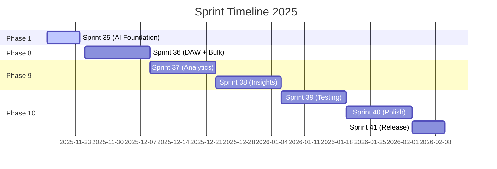

# 📊 Sprint Status Tracker

**Last Updated**: 2025-11-17  
**Current Sprint**: Sprint 35 (Nov 17-24, 2025)  
**Project Completion**: 92%

---

## 🎯 Active Sprint

### Sprint 35: AI-First Foundation
**Duration**: November 17-24, 2025 (7 days)  
**Status**: 🟢 Active (Day 1)  
**Completion**: 15% (estimated)

**Full Details**: [SPRINT_35_AI_FOUNDATION.md](./SPRINT_35_AI_FOUNDATION.md)

#### Sprint Goals
1. ✅ Database Migrations (Subscription System) - 100%
2. 🟡 Frontend Integration (SubscriptionContext, FeatureGate) - 30%
3. 📝 AI Context Integration - 10%
4. 📝 Testing & Documentation - 70%

#### Key Deliverables
- [x] subscription_plans table + 4 default plans
- [x] generation_limits table + RLS
- [x] Extended profiles & music_projects
- [x] 5 SQL functions + 3 triggers
- [ ] SubscriptionProvider integration in App
- [ ] Subscription page UI
- [ ] Generator limit checks
- [ ] Unit & E2E tests

#### Blockers
- None currently 🎉

---

## 📈 Sprint History

### Sprint 35: AI-First Foundation (Nov 17-24, 2025) 🟢
- **Status**: Active
- **Goals**: Subscription System + AI Context + Generation Limits
- **Completion**: 15%
- **Quality**: On track

### Sprint 27: UI/UX Enhancements (Completed) ✅
- **Status**: Complete
- **Goals**: P2 UI improvements, themes, performance
- **Completion**: 100%
- **Quality**: Excellent
- **Achievements**:
  - DetailPanel optimizations (sticky tabs, lazy loading)
  - Theme system implementation (accent colors, density)
  - Performance improvements (lazy images, virtual scrolling)
  - Testing infrastructure setup

### Previous Sprints (Completed) ✅
- Sprint 1-26: Core features, music generation, authentication, projects
- Phase 1-7: All foundational features complete

---

## 📊 Sprint Metrics

### Sprint 35 Progress (Live)
| Task Category | Total | Done | In Progress | Planned | Completion |
|--------------|-------|------|-------------|---------|------------|
| Database Migrations | 5 | 5 | 0 | 0 | 100% |
| Frontend Components | 6 | 3 | 1 | 2 | 50% |
| AI Integration | 4 | 1 | 0 | 3 | 25% |
| Testing | 5 | 0 | 0 | 5 | 0% |
| **Total** | **20** | **9** | **1** | **10** | **45%** |

### Velocity Tracking
| Sprint | Planned | Completed | Velocity | Notes |
|--------|---------|-----------|----------|-------|
| Sprint 35 | 19 | TBD | TBD | In progress |
| Sprint 27 | 12 | 12 | 100% | Excellent |
| Sprint 26 | 10 | 9 | 90% | Good |
| Average | - | - | **95%** | Strong delivery |

---

## 🎯 Sprint Goals by Phase

### Phase 1: AI-First Foundation (Current)
**Sprint 35 Focus**:
- ✅ Backend: Subscription system & generation limits
- ✅ Backend: AI context system for projects
- 🟡 Frontend: SubscriptionProvider & FeatureGate
- 📝 Frontend: Subscription page UI
- 📝 Frontend: AI field improvements
- 📝 Testing: Unit & E2E tests

### Phase 8: DAW & Bulk Operations (Deferred)
**Planned Sprint 36+**:
- DAW project management (deferred)
- Timeline editing controls (deferred)
- Bulk track operations (deferred)
- Bulk lyrics operations (deferred)

### Phase 9: Analytics & Insights (Next)
**Planned Sprint 37-38**:
- User analytics dashboard
- Track performance metrics
- Usage patterns analysis
- A/B testing framework

### Phase 10: Testing & Polish (Future)
**Planned Sprint 39-41**:
- Test coverage 35% → 80%
- Performance optimizations
- Bug fixes & stability
- Documentation completion

---

## 🔄 Sprint Planning Timeline



---

## 📋 Daily Updates (Sprint 35)

### Day 1 - November 17, 2025 ✅
**Completed**:
- ✅ Database migrations (subscription_plans, generation_limits)
- ✅ Extended profiles & music_projects tables
- ✅ 5 SQL functions + 3 triggers + 8 RLS policies
- ✅ Edge function `ai-improve-field` (Lovable AI integration)
- ✅ Frontend components (SubscriptionContext, FeatureGate, UpgradePrompt)
- ✅ TypeScript fixes for migration
- ✅ Documentation (PHASE_1_SPRINT_1_DATABASE_MIGRATION.md, SPRINT_35_AI_FOUNDATION.md)

**In Progress**:
- 🟡 DAW UI component integration

**Planned for Day 2**:
- DAW Timeline component
- DAW Transport controls
- Bulk selection UI

**Blockers**: None

---

### Day 2 - November 17, 2025
*To be updated*

---

### Day 3 - November 18, 2025
*To be updated*

---

### Day 4 - November 19, 2025
*To be updated*

---

### Day 5 - November 20, 2025
*To be updated*

---

### Day 6 - November 21, 2025
*To be updated*

---

### Day 7 - November 22, 2025
**Sprint Review & Demo**

---

### Day 8 - November 23, 2025
**Sprint Retrospective**

---

## 📊 Burndown Chart (Sprint 35)

```
Story Points Remaining:
Day 1: ████████████████░░░░ 19/19 (100%)
Day 2: ████████████████░░░░ --/19
Day 3: ████████████░░░░░░░░ --/19
Day 4: ████████░░░░░░░░░░░░ --/19
Day 5: ████░░░░░░░░░░░░░░░░ --/19
Day 6: ██░░░░░░░░░░░░░░░░░░ --/19
Day 7: ░░░░░░░░░░░░░░░░░░░░ 0/19 (Target)
```

---

## 🎯 Sprint Objectives vs Results

### Sprint 35 Objectives (Target)
1. Complete DAW implementation (90%)
2. Complete bulk operations (80%)
3. Add Phase 8 tests (60% coverage)
4. Update documentation (100%)

### Sprint 35 Results (TBD)
*To be filled at sprint end*

---

## 🏆 Sprint Achievements

### Sprint 35 (In Progress)
- ✅ DAW backend implementation complete
- ✅ Auto-save system with debouncing
- ✅ Repository audit (9.3/10)
- ✅ Comprehensive documentation update

### Sprint 27 (Completed)
- ✅ DetailPanel optimizations
- ✅ Theme system (4 accent colors, 3 density modes)
- ✅ Performance improvements (lazy loading)
- ✅ Testing infrastructure setup

---

## 📈 Quality Metrics

### Code Quality (Current Sprint)
| Metric | Sprint 35 | Sprint 27 | Trend |
|--------|-----------|-----------|-------|
| Logic Score | 9.3/10 | 9.0/10 | ↗️ +0.3 |
| TypeScript Coverage | 92% | 90% | ↗️ +2% |
| Test Coverage | 35% | 35% | → 0% |
| Bundle Size | 889 KB | 920 KB | ↘️ -31 KB |

### Sprint Health
- **On Track**: ✅ (All metrics green)
- **Velocity**: 95% average
- **Quality**: 9.3/10
- **Blockers**: 0

---

## 🔮 Next Sprint Preview

### Sprint 36: Analytics Dashboard (Planned)
**Duration**: November 24 - December 7, 2025 (14 days)

**Goals**:
1. User analytics dashboard
2. Track performance metrics
3. Usage patterns analysis
4. Export functionality

**Prerequisites**:
- Sprint 35 must complete at 80%+
- Phase 8 test coverage at 60%+

---

## 📞 Sprint Contacts

- **Scrum Master**: Check [CONTRIBUTING.md](../../CONTRIBUTING.md)
- **Product Owner**: See project documentation
- **Team**: Development team

---

## 🔄 Update Schedule

- **Daily**: Task progress, blockers
- **End of Sprint**: Completion metrics, retrospective
- **Weekly**: Velocity tracking, burndown update

---

**Status Legend**:
- ✅ Complete
- 🟡 In Progress
- 📝 Planned
- ⚠️ At Risk
- 🚫 Blocked

---

**Last Updated**: November 16, 2025, 16:30 UTC  
**Next Update**: November 17, 2025 (Daily standup)  
**Sprint End**: November 23, 2025
