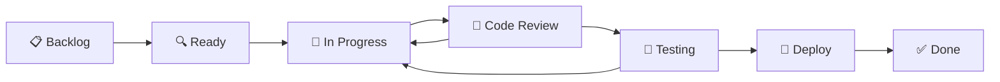
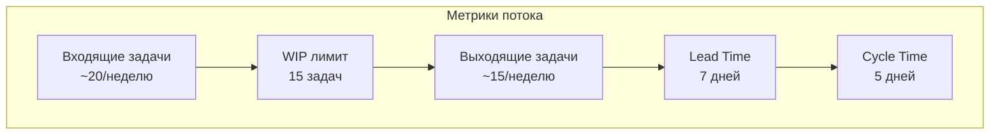

# 📋 Kanban Board для Albert3 Muse Synth Studio

*Последнее обновление: Декабрь 2024*

## 🎯 Обзор Kanban системы

Kanban доска - это визуальный инструмент для управления рабочим процессом разработки. Она помогает команде видеть статус всех задач, выявлять узкие места и оптимизировать поток работы.

## 📊 Структура доски

### Основные колонки



#### 1. 📋 Backlog (Бэклог)
- **Назначение**: Все новые задачи и идеи
- **Лимит**: Без ограничений
- **Критерии входа**: 
  - Задача создана в GitHub Issues
  - Есть базовое описание проблемы/требования
- **Критерии выхода**:
  - Задача детализирована и оценена
  - Определен приоритет
  - Назначен ответственный

#### 2. 🔍 Ready (Готово к работе)
- **Назначение**: Задачи, готовые к началу разработки
- **Лимит**: 10 задач
- **Критерии входа**:
  - Задача полностью описана
  - Есть acceptance criteria
  - Оценка сложности проставлена
  - Нет блокирующих зависимостей
- **Критерии выхода**:
  - Разработчик взял задачу в работу

#### 3. 🚧 In Progress (В работе)
- **Назначение**: Активная разработка
- **Лимит**: 3 задачи на разработчика
- **Критерии входа**:
  - Задача назначена на разработчика
  - Создана feature ветка
  - Начата разработка
- **Критерии выхода**:
  - Код написан
  - Локальные тесты проходят
  - Создан Pull Request

#### 4. 👀 Code Review (Ревью кода)
- **Назначение**: Проверка качества кода
- **Лимит**: 5 PR
- **Критерии входа**:
  - Pull Request создан
  - CI проверки проходят
  - Код готов к ревью
- **Критерии выхода**:
  - Получен approve от ревьюера
  - Все комментарии учтены
  - Конфликты разрешены

#### 5. 🧪 Testing (Тестирование)
- **Назначение**: QA тестирование в staging
- **Лимит**: 3 задачи
- **Критерии входа**:
  - PR смержен в develop
  - Деплой в staging выполнен
  - Готов к тестированию
- **Критерии выхода**:
  - Все тесты пройдены
  - Баги исправлены
  - Готов к продакшену

#### 6. 🚀 Deploy (Деплой)
- **Назначение**: Подготовка к релизу
- **Лимит**: 2 задачи
- **Критерии входа**:
  - QA тестирование завершено
  - Готов к деплою в production
- **Критерии выхода**:
  - Деплой в production выполнен
  - Мониторинг показывает стабильность

#### 7. ✅ Done (Завершено)
- **Назначение**: Полностью завершенные задачи
- **Лимит**: Последние 20 задач
- **Критерии входа**:
  - Функция работает в production
  - Мониторинг стабилен
  - Документация обновлена

## 🏷 Система меток и приоритетов

### Приоритеты (цветовая схема)
- 🔴 **Critical**: Критические баги, блокирующие работу
- 🟠 **High**: Важные функции, срочные исправления
- 🟡 **Medium**: Обычные задачи разработки
- 🟢 **Low**: Улучшения, рефакторинг, техдолг

### Типы задач
- 🐛 **Bug**: Исправление ошибок
- ✨ **Feature**: Новая функциональность
- 🔧 **Improvement**: Улучшение существующего
- 📚 **Documentation**: Работа с документацией
- 🧪 **Testing**: Написание тестов
- 🔒 **Security**: Вопросы безопасности

### Компоненты
- 🎨 **Frontend**: React, UI/UX
- ⚙️ **Backend**: Node.js, API
- 🗄️ **Database**: Supabase, PostgreSQL
- 🔌 **Integration**: Внешние API, Suno
- 🚀 **DevOps**: CI/CD, деплой
- 📱 **Mobile**: Мобильная версия

## 📈 Метрики и KPI

### Основные метрики

#### Lead Time (Время выполнения)
```
Lead Time = Время от создания задачи до Done
Цель: < 7 дней для обычных задач
```

#### Cycle Time (Время цикла)
```
Cycle Time = Время от Ready до Done
Цель: < 5 дней
```

#### Throughput (Пропускная способность)
```
Throughput = Количество задач в Done за неделю
Цель: 10-15 задач/неделю
```

#### Work In Progress (WIP)
```
WIP = Общее количество задач в In Progress + Code Review + Testing
Цель: < 15 задач одновременно
```

### Диаграмма потока (Flow Diagram)


## 🔄 Ежедневные ритуалы

### Daily Standup (9:00)
1. **Обзор доски**: Что изменилось с вчера
2. **Блокеры**: Задачи, застрявшие в колонках
3. **WIP лимиты**: Проверка соблюдения ограничений
4. **Приоритеты**: Корректировка на день

### Формат обновлений
```markdown
## Daily Update - [Дата]

### 🚧 In Progress
- [TASK-123] Реализация OAuth авторизации - @developer1 (80%)
- [TASK-124] Оптимизация API запросов - @developer2 (60%)

### 🚫 Blocked
- [TASK-125] Интеграция с Suno API - ждем API ключ

### 👀 Needs Review
- [TASK-120] Новый UI для плейлистов - готов к ревью
- [TASK-121] Исправление бага с аудио - ждет approve

### ✅ Completed Yesterday
- [TASK-118] Настройка CI/CD pipeline
- [TASK-119] Обновление документации API
```

## 🛠 Инструменты и автоматизация

### GitHub Projects настройка

#### Создание проекта
```bash
# Создание через GitHub CLI
gh project create --title "Albert3 Kanban Board" --body "Основная доска для разработки"
```

#### Настройка полей
```yaml
# Кастомные поля для проекта
fields:
  - name: "Priority"
    type: "single_select"
    options: ["Critical", "High", "Medium", "Low"]
  
  - name: "Story Points"
    type: "number"
    
  - name: "Component"
    type: "multi_select"
    options: ["Frontend", "Backend", "Database", "Integration", "DevOps"]
  
  - name: "Sprint"
    type: "text"
    
  - name: "Estimate"
    type: "number"
```

### Автоматизация движения карточек

#### GitHub Actions для автоматизации
```yaml
# .github/workflows/kanban-automation.yml
name: Kanban Automation

on:
  pull_request:
    types: [opened, closed, merged]
  issues:
    types: [opened, closed, assigned]

jobs:
  move-cards:
    runs-on: ubuntu-latest
    steps:
      - name: Move to Code Review on PR open
        if: github.event_name == 'pull_request' && github.event.action == 'opened'
        run: |
          # Переместить связанную задачу в Code Review
          
      - name: Move to Testing on PR merge to develop
        if: github.event_name == 'pull_request' && github.event.action == 'closed' && github.event.pull_request.merged == true && github.event.pull_request.base.ref == 'develop'
        run: |
          # Переместить в Testing
          
      - name: Move to Done on deploy to production
        if: github.event_name == 'deployment' && github.event.deployment.environment == 'production'
        run: |
          # Переместить в Done
```

### Интеграция с Slack
```yaml
# Уведомления в Slack о движении карточек
slack_notifications:
  - trigger: "card_moved_to_blocked"
    message: "⚠️ Задача заблокирована: {task_title}"
    channel: "#dev-alerts"
  
  - trigger: "wip_limit_exceeded"
    message: "🚨 Превышен WIP лимит в колонке {column_name}"
    channel: "#dev-team"
  
  - trigger: "card_in_review_too_long"
    message: "⏰ Задача в ревью больше 2 дней: {task_title}"
    channel: "#code-review"
```

## 📊 Дашборд и отчетность

### Еженедельный отчет
```markdown
# Kanban Report - Week [Номер недели]

## 📈 Ключевые метрики
- **Throughput**: 12 задач завершено
- **Lead Time**: 6.2 дня (среднее)
- **Cycle Time**: 4.1 дня (среднее)
- **WIP**: 13 задач (в пределах лимита)

## 🎯 Выполнение целей
- ✅ Throughput: 12/15 (80%)
- ✅ Lead Time: 6.2/7 дней
- ✅ Cycle Time: 4.1/5 дней
- ✅ WIP Limit: 13/15

## 🚫 Проблемы и блокеры
- Code Review: 2 задачи ждут ревью > 2 дней
- Testing: Нехватка QA ресурсов

## 💡 Улучшения на следующую неделю
- Добавить автоматические напоминания о ревью
- Привлечь дополнительного QA тестера
```

### Burndown Chart
```mermaid
gantt
    title Sprint Burndown Chart
    dateFormat  X
    axisFormat %d
    
    section Planned
    Planned Work    :0, 7
    
    section Actual
    Actual Work     :0, 1, 2, 4, 3, 2, 1
```

## 🔧 Настройка и оптимизация

### Анализ узких мест

#### Типичные проблемы
1. **Накопление в Code Review**
   - Решение: Ограничить WIP, назначить ответственных за ревью
   
2. **Долгое тестирование**
   - Решение: Автоматизация тестов, параллельное тестирование
   
3. **Блокировки по зависимостям**
   - Решение: Раннее выявление, планирование зависимостей

#### Оптимизация WIP лимитов
```python
# Формула для расчета оптимального WIP
WIP_limit = Team_size * 1.5

# Для команды из 3 разработчиков
WIP_optimal = 3 * 1.5 = 4.5 ≈ 5 задач в In Progress
```

### Continuous Improvement

#### Ретроспективы каждые 2 недели
1. **Что работает хорошо?**
2. **Что можно улучшить?**
3. **Какие эксперименты попробовать?**

#### Эксперименты для улучшения
- Изменение WIP лимитов
- Добавление новых колонок
- Автоматизация рутинных процессов
- Изменение критериев готовности

---

*Kanban доска - это живой инструмент, который должен адаптироваться под потребности команды и проекта*