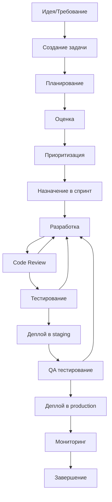

# 🔄 Процесс разработки Albert3 Muse Synth Studio

*Последнее обновление: Декабрь 2024*

## 🎯 Обзор процесса

Мы используем Agile методологию с элементами Scrum и Kanban для обеспечения быстрой и качественной разработки. Процесс оптимизирован для небольшой команды с фокусом на непрерывную интеграцию и доставку.

## 📋 Жизненный цикл задачи



## 🏃‍♂️ Спринт процесс

### Длительность спринта: 1 неделя

### Sprint Planning (Понедельник, 9:00)
- **Длительность**: 2 часа
- **Участники**: Вся команда
- **Цели**:
  - Ревью бэклога
  - Выбор задач для спринта
  - Оценка сложности
  - Определение целей спринта

### Daily Standup (Ежедневно, 9:00)
- **Длительность**: 15 минут
- **Участники**: Команда разработки
- **Формат**:
  - Что сделано вчера?
  - Что планируется сегодня?
  - Есть ли блокеры?

### Sprint Review (Пятница, 15:00)
- **Длительность**: 1 час
- **Участники**: Команда + stakeholders
- **Цели**:
  - Демонстрация результатов
  - Получение обратной связи
  - Обновление бэклога

### Sprint Retrospective (Пятница, 16:00)
- **Длительность**: 1 час
- **Участники**: Команда разработки
- **Формат**:
  - Что прошло хорошо?
  - Что можно улучшить?
  - Action items на следующий спринт

## 🔧 Технический процесс

### Git Workflow

#### Ветки
```
main (production)
├── develop (integration)
├── feature/TASK-123-new-feature
├── bugfix/TASK-456-fix-bug
├── hotfix/critical-security-fix
└── release/v1.1.0
```

#### Правила именования веток
- `feature/TASK-ID-short-description` - новые функции
- `bugfix/TASK-ID-short-description` - исправления багов
- `hotfix/short-description` - критические исправления
- `release/vX.Y.Z` - подготовка релиза

#### Commit Messages
Используем Conventional Commits:
```
type(scope): description

feat(auth): add OAuth2 integration
fix(api): resolve timeout issues
docs(readme): update installation guide
test(unit): add tests for music generation
refactor(ui): improve component structure
```

### Code Review Process

#### Обязательные проверки
- [ ] Код соответствует стандартам проекта
- [ ] Добавлены/обновлены тесты
- [ ] Документация обновлена
- [ ] Нет security уязвимостей
- [ ] Performance не ухудшился
- [ ] Backward compatibility сохранена

#### Критерии для merge
- ✅ Минимум 1 approve от senior разработчика
- ✅ Все CI/CD проверки прошли
- ✅ Нет конфликтов с target веткой
- ✅ Покрытие тестами не снизилось

### Definition of Done

#### Для задачи
- [ ] Код написан и протестирован
- [ ] Unit тесты добавлены/обновлены
- [ ] Code review пройден
- [ ] Integration тесты проходят
- [ ] Документация обновлена
- [ ] Задача протестирована в staging

#### Для спринта
- [ ] Все задачи соответствуют DoD
- [ ] Regression тесты проходят
- [ ] Performance тесты проходят
- [ ] Security scan пройден
- [ ] Готов к деплою в production

## 🧪 Тестирование

### Пирамида тестирования
```
        /\
       /E2E\      <- Мало, но критичные пути
      /____\
     /      \
    /Integration\ <- Средний уровень
   /____________\
  /              \
 /   Unit Tests   \  <- Основа, много и быстро
/________________\
```

### Типы тестов

#### Unit Tests (70%)
- Тестирование отдельных функций/методов
- Быстрые и изолированные
- Запускаются при каждом commit

#### Integration Tests (20%)
- Тестирование взаимодействия компонентов
- API endpoints
- Database операции

#### E2E Tests (10%)
- Критические пользовательские сценарии
- Полный workflow от UI до DB
- Запускаются перед релизом

### Автоматизация тестирования

#### Pre-commit hooks
```bash
# Запускается перед каждым commit
- ESLint проверки
- Prettier форматирование
- Unit тесты
- Type checking
```

#### CI Pipeline
```yaml
# GitHub Actions workflow
1. Lint и форматирование
2. Unit тесты
3. Build проекта
4. Integration тесты
5. Security scan
6. Deploy в staging
7. E2E тесты
8. Performance тесты
```

## 🚀 Деплой процесс

### Окружения

#### Development
- **URL**: localhost:3000
- **Цель**: Локальная разработка
- **Данные**: Mock данные
- **Деплой**: Автоматически при запуске

#### Staging
- **URL**: staging.albert3-muse.com
- **Цель**: Тестирование перед production
- **Данные**: Копия production (анонимизированная)
- **Деплой**: Автоматически при merge в develop

#### Production
- **URL**: albert3-muse.com
- **Цель**: Живая система
- **Данные**: Реальные пользовательские данные
- **Деплой**: Ручной trigger после approval

### Стратегия деплоя

#### Blue-Green Deployment
1. Подготовка новой версии (Green)
2. Тестирование Green окружения
3. Переключение трафика с Blue на Green
4. Мониторинг и rollback при необходимости

#### Rollback план
- Автоматический rollback при критических ошибках
- Ручной rollback в течение 5 минут
- Backup данных перед каждым деплоем

## 📊 Мониторинг и метрики

### Ключевые метрики

#### Разработка
- **Lead Time**: Время от создания задачи до деплоя
- **Cycle Time**: Время активной разработки
- **Deployment Frequency**: Частота деплоев
- **Change Failure Rate**: Процент неудачных деплоев

#### Качество
- **Code Coverage**: Покрытие тестами (цель: >80%)
- **Bug Escape Rate**: Баги, найденные в production
- **Technical Debt**: Время на исправление legacy кода
- **Code Review Time**: Время на code review

### Инструменты мониторинга

#### Разработка
- **GitHub**: Управление кодом и задачами
- **GitHub Actions**: CI/CD pipeline
- **SonarQube**: Анализ качества кода
- **Dependabot**: Обновление зависимостей

#### Production
- **Supabase**: Database мониторинг
- **Vercel**: Application мониторинг
- **Sentry**: Error tracking
- **Google Analytics**: User behavior

## 🔒 Безопасность в процессе

### Security Checks

#### В процессе разработки
- Static code analysis (ESLint security rules)
- Dependency vulnerability scanning
- Secret scanning в коде
- OWASP Top 10 проверки

#### Перед релизом
- Penetration testing
- Security audit
- Compliance проверки
- Access control review

### Управление секретами
- Все секреты в environment variables
- Использование GitHub Secrets
- Ротация ключей каждые 90 дней
- Принцип минимальных привилегий

## 📚 Документация

### Обязательная документация
- **README.md**: Как запустить проект
- **API.md**: Документация API
- **ARCHITECTURE.md**: Архитектура системы
- **DEPLOYMENT.md**: Инструкции по деплою

### Поддержание актуальности
- Обновление при каждом изменении
- Ревью документации в рамках code review
- Ежемесячная проверка актуальности

## 🤝 Коммуникация

### Каналы связи
- **Slack**: Ежедневное общение
- **GitHub**: Обсуждение кода и задач
- **Email**: Официальные уведомления
- **Zoom**: Встречи и планирование

### Эскалация проблем
1. **Уровень 1**: Обсуждение в команде
2. **Уровень 2**: Tech Lead
3. **Уровень 3**: Product Owner
4. **Уровень 4**: Management

---

*Процесс постоянно улучшается на основе ретроспектив и обратной связи команды*